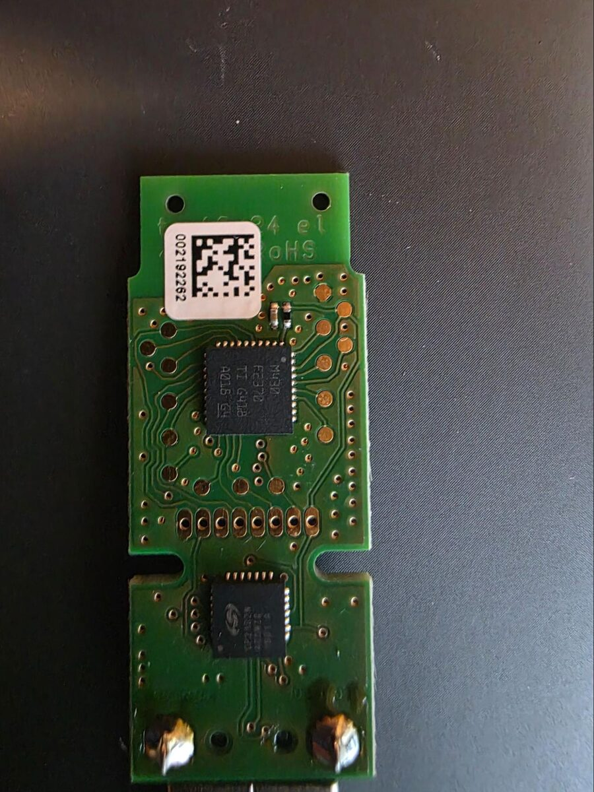
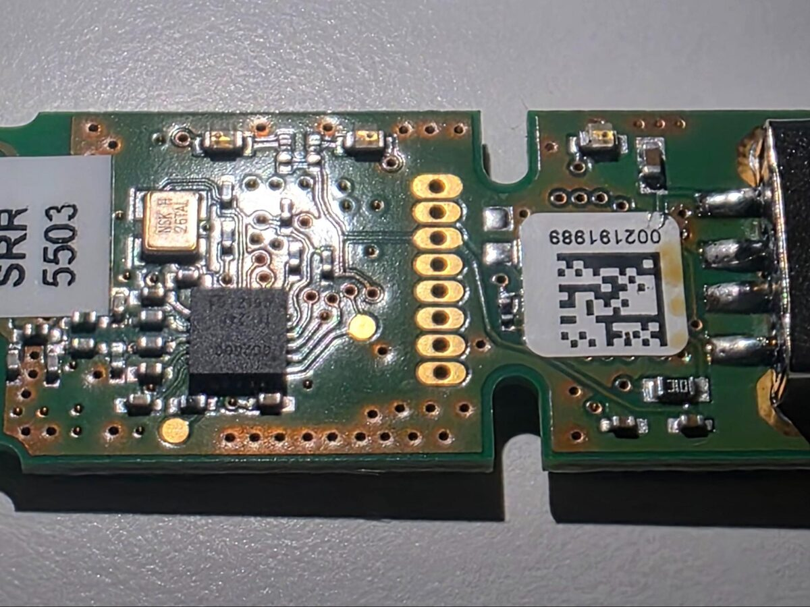
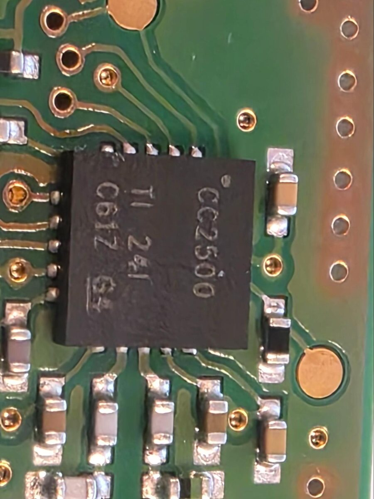
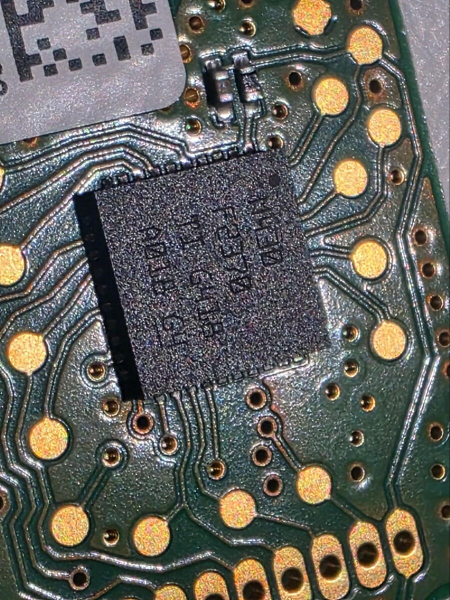
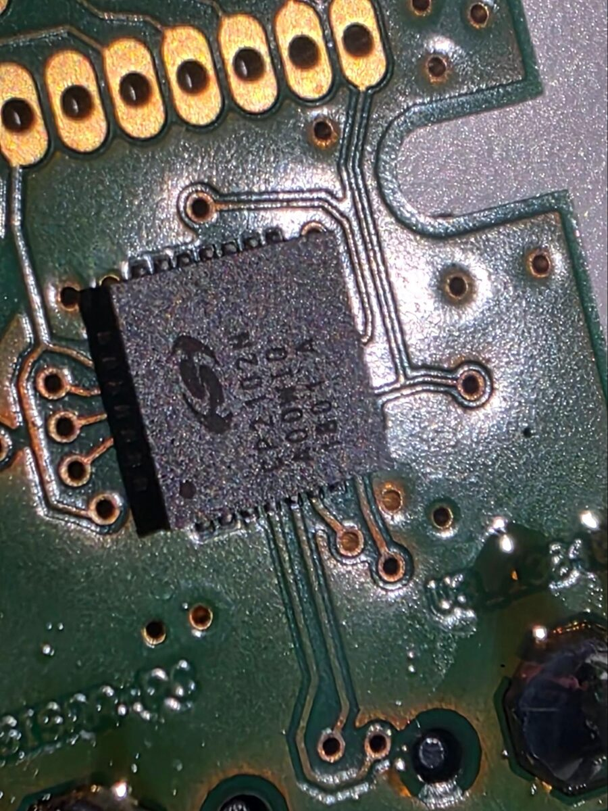
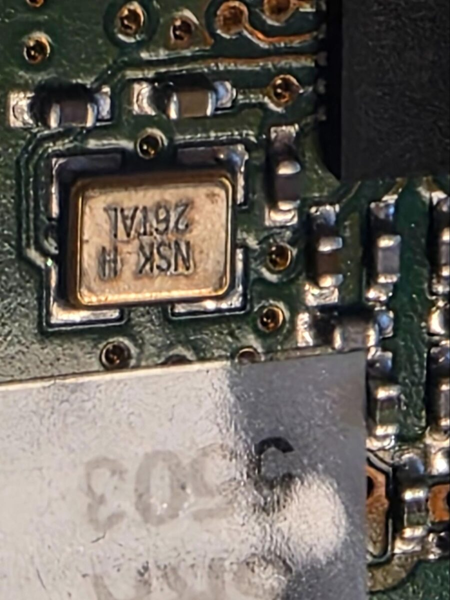
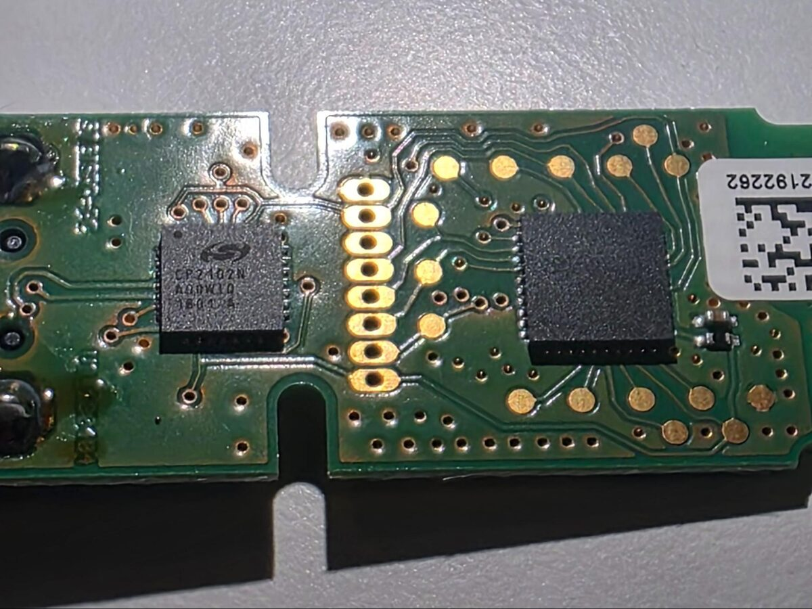
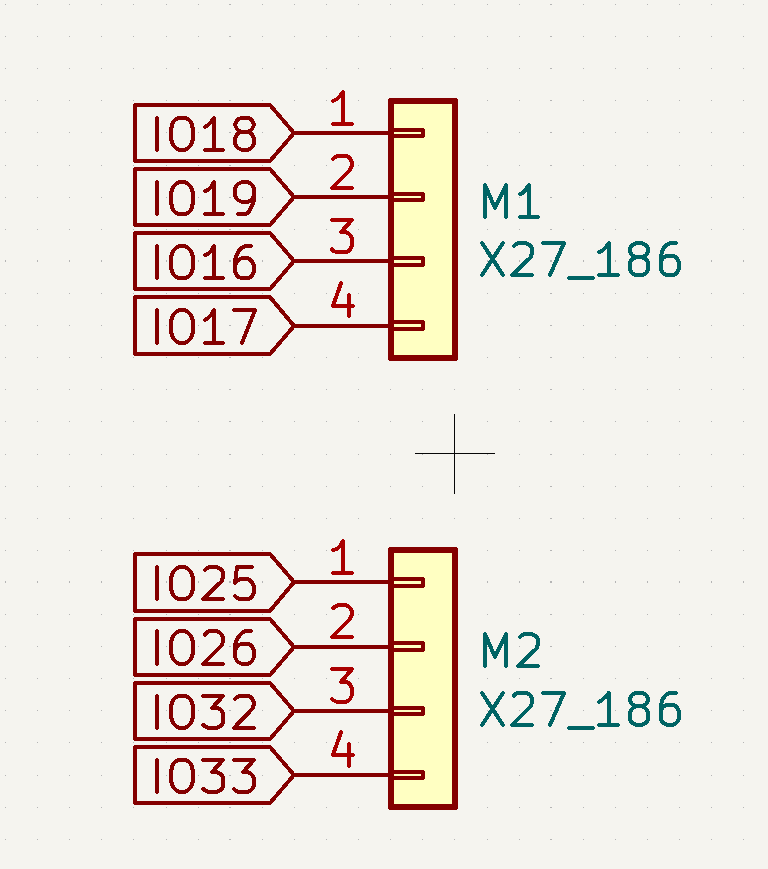
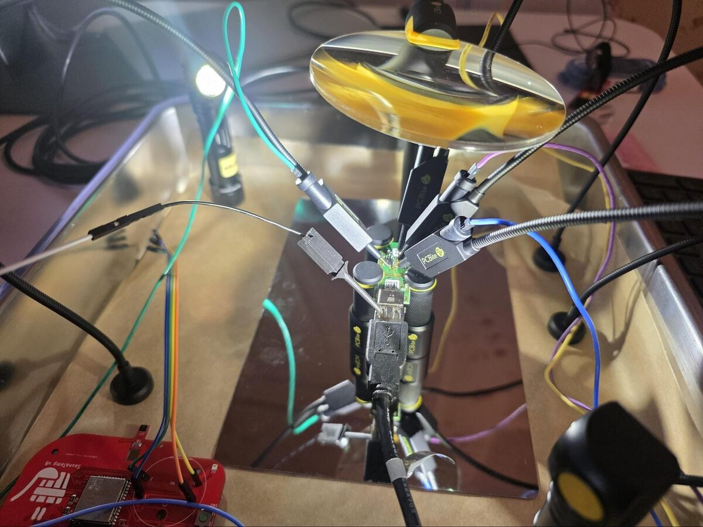
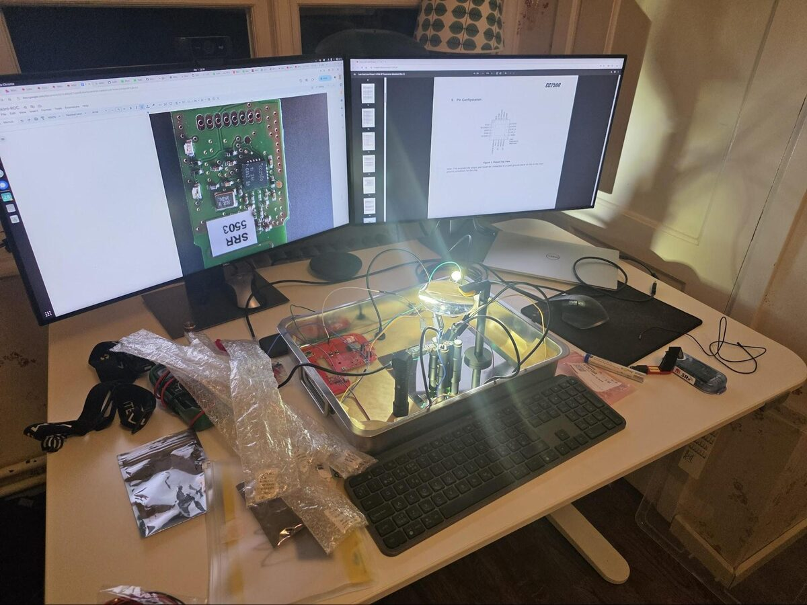

# How the SRR protocol was reverse engineered

A write-up of the process, for anyone who wants to repeat it on another
device — or who is curious what a hobby reverse-engineering project looks
like from the inside. The whole thing was done at a kitchen table with
hobby-grade parts, over evenings in late 2025 and early 2026.

## Motivation

Orienteering events use radio controls to get intermediate times to the
finish area for commentary and live results. SPORTident's system for this is
SRR: SIAC cards and BSF8-SRR stations transmit punches over a short-range
2.4 GHz link to an **SRR USB dongle** plugged into a laptop, or to
SPORTident's own GSM/LTE modem. Both receivers are proprietary and the
modem is expensive enough that clubs deploy few of them.

The goal was to build an open radio online control (working name OROC):
a small, battery-powered box with a 2.4 GHz receiver and an LTE modem that
listens for SRR punches and forwards them to a results server. That requires
understanding the SRR air interface, which SPORTident does not document.

## Step 1 — Look inside the dongle

The SRR dongle is the cheapest SRR receiver and, crucially, it is a
*separate radio chip driven by a separate microcontroller*. That means the
whole configuration of the radio — frequency, modulation, data rate, sync
word, packet format — has to pass over a bus between the two chips, where it
can be watched.





Opening the case and reading the part markings (a phone camera through a
magnifier is enough) gave the full bill of materials:

| Part | Role | Photo |
|------|------|-------|
| TI **CC2500** | 2.4 GHz transceiver |  |
| TI **MSP430F2370** | Microcontroller running SPORTident's firmware |  |
| Silicon Labs **CP2102N** | USB ↔ UART bridge to the PC |  |
| NSK 26 MHz crystal | CC2500 reference |  |

Plus a meander PCB antenna at the far end of the board and a row of eight
test pads between the two halves.



The CC2500 was the key discovery. It is a well-documented, widely used chip
(RC toys, wireless keyboards, hobby projects), its register map is public,
and it is available for a couple of euros on breakout boards. If the dongle
uses a stock CC2500, then *any* CC2500 loaded with the same registers is an
SRR receiver.

## Step 2 — Find the SPI bus

From the [CC2500 datasheet](https://www.ti.com/lit/ds/symlink/cc2500.pdf)
(QFN-20): pin 1 `SCLK`, pin 2 `SO`, pin 7 `CSn`, pin 20 `SI`. From the
[MSP430F2370 datasheet](https://www.ti.com/lit/ds/symlink/msp430f2370.pdf):
the USCI B0 SPI pins are P3.1/P3.2/P3.3 (pins 19–21).

Following traces from those pins showed that two of the four SPI signals
(`SCLK` and `SI`) come out on the test pad row (pads 7 and 3). `SO` and
`CSn` do not, and had to be probed on the CC2500 pins themselves, which are
0.5 mm pitch.

## Step 3 — Capture it

A commercial logic analyser was not on hand, but a spare ESP32 board was.
The board in the photos is a home-made sauna thermometer ("SaunaTemp v8")
which happened to have two 4-pin connectors broken out to GPIO 16/17/18/19
and 25/26/32/33:



Loaded with Phil Schatzmann's
[logic-analyzer](https://github.com/pschatzmann/logic-analyzer) firmware it
speaks the SUMP protocol, so [sigrok PulseView](https://sigrok.org/wiki/PulseView)
can drive it directly and run its SPI protocol decoder on the capture.

Physically getting onto the pins was the fiddliest part. A set of spring-arm
PCB probes (PCBite-style, with needle tips) held on a steel tray with magnets
was used, with a USB extension so the dongle could sit upright:





Channel assignment used for the captures:

| LA channel | Wire | Signal |
|------------|------|--------|
| 0 | blue | `SI` (MOSI) |
| 1 | green | `SO` (MISO) |
| 2 | purple | `SCLK` |
| 4 | yellow | `CSn` |

The dongle was then plugged in, and later punched at, while capturing.

## Step 4 — Read the capture

The CC2500 SPI protocol is simple: one header byte (`R/W`, burst bit, 6-bit
address) followed by data. PulseView's SPI decoder turns the capture into a
byte stream; from there, the dongle's boot sequence reads as a list of
register writes:

```
IOCFG..., FSCTRL1=07, FSCTRL0=00, FREQ2=5D, FREQ1=44, FREQ0=EC,
MDMCFG4=2D, MDMCFG3=3B, MDMCFG2=73, MDMCFG1=23, MDMCFG0=3B, DEVIATN=01,
MCSM1=3F, MCSM0=18, FOCCFG=1D, BSCFG=1C, AGCCTRL2=C7, AGCCTRL1=00,
AGCCTRL0=B0, FREND1=B6, FREND0=10, FSCAL3=EA, FSCAL2=0A, FSCAL1=00,
FSCAL0=11, PKTCTRL1=0C, PKTCTRL0=05, PKTLEN=29, SYNC1=D3, SYNC0=91,
CHANNR=92 (or BA)
```

Plugging those into the datasheet formulas gives the numbers in
[protocol.md §2](protocol.md#2-physical-layer-) — and, reassuringly, they
turn out to be TI's own SmartRF Studio "250 kBaud MSK" preset with a custom
base frequency. A decoding mistake would not have landed on a known preset.

With punches in the capture, the RX FIFO burst reads (`0xFF` header) show
the received frames — starting with the ASCII `siok` that identifies SRR
traffic — and the TX FIFO burst writes (`0x7F` header) immediately after
each one show the dongle's 13-byte acknowledgement. That is where the frame
layout and the ACK format in [protocol.md](protocol.md) come from.

## Step 5 — Validate against known punches

To map bytes to fields, the same punches were read out the conventional way.
The test station's backup memory was read via the SPORTident serial
protocol — it holds control number, card number and time for every punch —
giving a ground-truth list of `(station, card, time)` to match against the
captured frames. Card numbers are easy to spot as 3–4 byte big-endian
integers, and the SPORTident time encoding (16-bit seconds + 1/256 s) was
already known from the serial protocol, so once one field was anchored the
rest of the layout followed.

## Step 6 — Re-implement, then fight the real world

With the register set and the frame format in hand, the receiver in
[`arduino/esp32-cc2500-srr-receiver`](../arduino/esp32-cc2500-srr-receiver/)
was written for an ESP32 and a cheap CC2500 breakout module. This is where
most of the hours went, and where the interesting engineering lessons are:

* **Reception was unreliable at first.** The cheap module's crystal drifts
  enough that frames fell partly outside the dongle's 541 kHz RX filter.
  Widening the filter to 812 kHz (`MDMCFG4 = 0x0D`) fixed it. Lesson: copy
  the config, but understand the tolerances your hardware actually has.
* **Punches arrived many times.** Because the ESP32 was not ACKing, the
  transmitters kept retrying. Implementing the ACK exactly as the dongle
  sends it made each punch arrive once.
* **The ACK had to be fast.** Doing anything — parsing, `Serial.print` —
  between the end of the received frame and the ACK meant the transmitter
  had already given up. The ACK window is on the order of a millisecond,
  and the ACK itself takes 0.7 ms on air. The receiver now ACKs before it
  does anything else.
* **Interrupts made it worse.** A carrier-sense interrupt for noise
  measurement disturbed SPI timing on the same core enough to miss the ACK
  window. Everything moved to polling in `loop()`.
* **Two channels.** Transmitters alternate between blue and red, about
  30 ms apart, up to six times until acknowledged. The receiver measures how long carrier sense is asserted per second, and if
  the channel is saturated (typically Wi-Fi — both SRR channels sit on Wi-Fi
  channel centres) it hops to the other one. This was tested by running a
  second CC2500 as an interference source on one channel at a time.

Much of the iterating on register settings and timing was done in a long
back-and-forth with an LLM (Gemini), which was useful for quickly turning
datasheet formulas into numbers and for suggesting hypotheses, and not
useful at all for anything that required actually looking at the signal —
including a confident but wrong claim that the link ran at 38.4 kbit/s,
which survived in code comments until this repository was written.

## What it took

* Tools: phone camera, magnifier, spring-arm PCB probes, an ESP32 as a
  SUMP logic analyser, PulseView, Arduino IDE.
* Parts: one SRR USB dongle (opened), an ESP32 dev board, CC2500 breakout
  modules, a SIAC and SRR-capable stations to generate traffic.
* Reading: CC2500 datasheet, MSP430F2370 datasheet, TI application note
  [SWRA116](https://www.ti.com/lit/an/swra116a/swra116a.pdf).

## What it did not take

* No firmware was extracted from the dongle, the SIAC or any station.
* No encryption or protection mechanism was bypassed — there is none.
* No SPORTident software was decompiled.

See [legal.md](legal.md) for why that matters.
